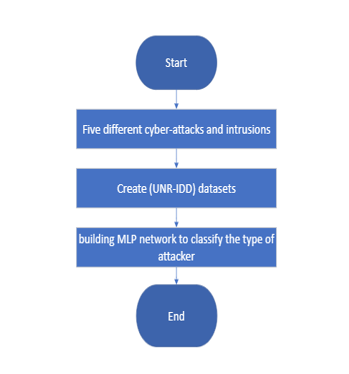
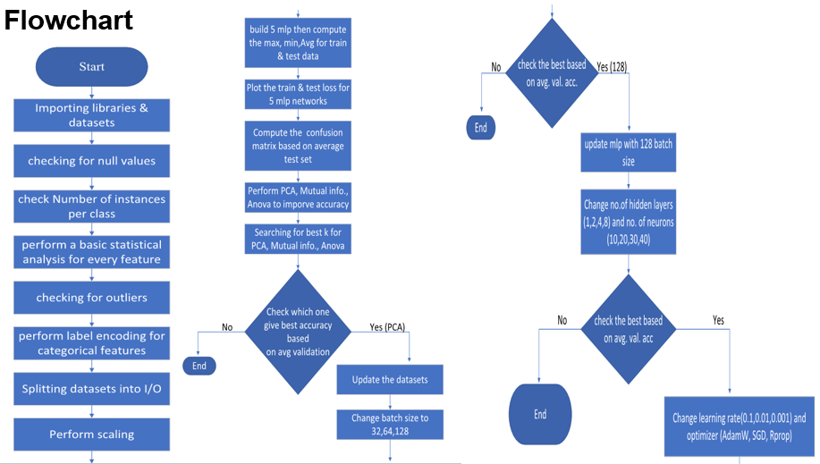
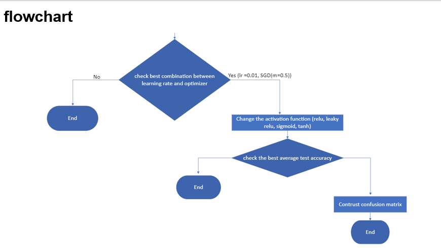

# Network Attackers Classification.

## Descriptin
In this project, we classify the attackers using neural ntworks.

 ## Problem Overview:

## Flow Chart of the project:

# Conclosion:
- We applied the MLP network in several stages.

- First, we perform baseline MLP then we applied several hyperparameters tuning

- Hyperparameter tuning is very powerful transforming the accuracy from 19% to 51.4%

- Make a combination of several hyperparameters to choose the best
